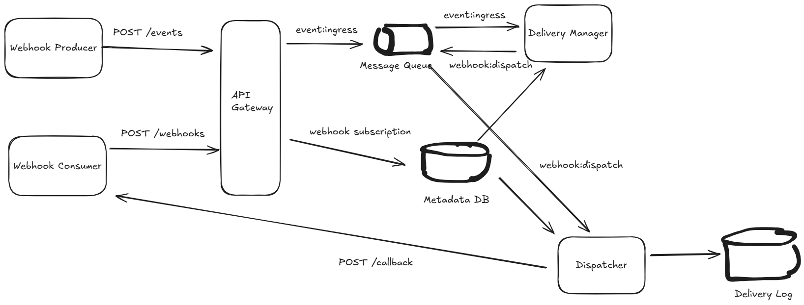

### <strong>!!!NOTE</strong>: WIP
some features still in development, doc below does not reflect latest changes.

Author's TODO:
- Delivery Tracking with Apache Cassandra
- Retry Mechanism
- Error Handling, Dead letter queue
- Security for internal communication via Kafka, SASL auth, encrypted message
- Centralized Logging
- Cron for cleanup Cassandra outdated logs
- Dockerize apps
- [optional] Testing - mainly on e2e test, unit test on utility
- [optional] Webhook Dashboard
- [optional] Kubernetes


<hr />


# Project Overview

Kolbak - a webhook service that is built with Nest.js.

<div align="center">
    
</div>


# System Components

- `API Gateway`
    - Ingress Handling - Receives incoming event notifications from Producers. Authenticates/authorizes producers. Performs basic validation (e.g., required fields, format). Rate limiting. Enqueues validated events into the Message Queue.
    - Subscription Management -  Provides endpoints for consumers (or administrators) to register, update, delete, and list webhook subscriptions. This includes specifying the target URL, event types to subscribe to, authentication secrets (for signing), and activation status.

- `Message Worker(Dispatcher)` 
    - Consumes events from the Message Queue. For each event, looks up the relevant active subscriptions in the Configuration Database. Formats the HTTP request payload. Makes the HTTP POST call to the registered Consumer URL. Handles responses (success, transient failures, permanent failures). Records delivery status and triggers retries if necessary.
    - Scalable pool of workers (can be scaled horizontally based on queue depth or delivery latency). Needs to be resilient to consumer endpoint failures.
- `Message Queue`
    - Acts as a persistent, scalable buffer between the Ingestion Service and the Dispatchers. Decouples event production from delivery, absorbs traffic spikes, and ensures events are not lost if dispatchers are temporarily unavailable.
    - High throughput, persistence, partitioning/sharding capabilities (e.g., Kafka, RabbitMQ, AWS SQS, Google Pub/Sub).
- `Metadata DB`
    -  Stores webhook subscription details (Consumer URL, subscribed event types, shared secrets for signing, enabled/disabled status, etc.). Also stores configuration for the webhook service itself (e.g., retry policies).
    - Needs to be reliable and consistent. A relational database (like PostgreSQL, MySQL) is often suitable.
- `Delivery Log`
    - Records the status of each delivery attempt (e.g., pending, success, failed, retrying), timestamps, response codes, attempt counts. Used by Dispatchers to manage retries and by monitoring systems. Potentially stores failure reasons.
    - Needs to handle high write volume. A NoSQL database (like DynamoDB, Cassandra, Scylladb) or even caching layers might be suitable, depending on query patterns. Can sometimes be combined with the Configuration DB if performance allows.

# API Design

base version: v1

## Auth

### login

POST /auth

Request Body:
```json
{
    "grant_type": "client_credentials",
    "client_id": "your-client-id",
    "client_secret": "your-client-secret"
}
```

Response Body:
```json
{
    "access_token": "eyJhbGciOiJIUzI1...",
    "token_type": "Bearer",
    "expires_in": 3600
}
```

## API Key
### Get a API Key
GET /keys/{:id}

Authorization:
bearer token(from /auth) 

Response:
```json
// 200 OK
{
    "data": {
        "id": "ulid",
        "key": "XDHJEUU0011",
        "name": "Key 1",
        "description": "This is Key",
        "scopes": ["read:webhooks", "write:webhooks"],
        "last_accessed_at": "2025-03-31T01:00:00.00z",
        "created_at": "2025-03-31T01:00:00.00z",
        "updated_at": "2025-03-31T01:00:00.00z"
    },
    "error": null,
    "pagination": null
}

```

### Query API keys
GET /keys

Authorization:
bearer token(from /auth) 

Response:
```json
// 200 OK
{
    "data": [
       "id": "ulid",
        "key": "XDHJEUU0011",
        "name": "Key 1",
        "description": "This is Key",
        "scopes": ["read:webhooks", "write:webhooks"],
        "last_accessed_at": "2025-03-31T01:00:00.00z",
        "created_at": "2025-03-31T01:00:00.00z",
        "updated_at": "2025-03-31T01:00:00.00z"
    ],
    "error": null,
    "pagination": {
        "limit": 20,
        "offset": 0,
        "total": 1
    }
}
```


### Create an API key
POST /keys

Authorization:
bearer token(from /auth) 

Resquest Body:
```json
{
    "name": "Key 1",
    "description": "This is Key", // optional    
    "scopes": ["read:webhooks", "write:webhooks"]
}
```

Response:
```json
// 201 Created
{
    "data": {
        "id": "ulid",
        "key": "XDHJEUU0011",
        "name": "Key 1",
        "description": "This is Key",
        "last_accessed_at": "2025-03-31T01:00:00.00z",
        "scopes": ["read:webhooks", "write:webhooks"],
        "created_at": "2025-03-31T01:00:00.00z",
        "updated_at": "2025-03-31T01:00:00.00z"
    },
    "error": null,
    "pagination": null
}
```

### Update an API key
PATCH /keys/{:id}

Authorization:
bearer token(from /auth) 

Request Body:
```json
{
    "name": "Key 1", // optional
    "description": "This is Key", // optional    
    "scopes": ["read:webhooks", "write:webhooks"] // optional
}
```

Response:
```json
// 200 OK
{
    "data": {
        "id": "ulid",
        "key": "XDHJEUU0011",
        "name": "Key 1",
        "description": "This is Key",
        "scopes": ["read:webhooks", "write:webhooks"],
        "last_accessed": "2025-03-31T01:00:00.00z",
        "created_at": "2025-03-31T01:00:00.00z",
        "updated_at": "2025-03-31T01:00:00.00z"
    },
    "error": null,
    "pagination": null
}
```

### Delete an API key
DELETE /keys/{:id}

Authorization:
bearer token(from /auth) 

Response:
```json
// 204 No Content
{
    "data": null,
    "error": null,
    "pagination": null
}
```

## Webhook Subscription

### Retrieve a subscription
GET /webhooks/{:id}

Authorization:
bearer token(from /auth) 
or with x-api-key in header

Response Body:
```json
// 200 OK
{
    "id": "ulid",
    "callback_url": "https://consumer.example.com/webhook-receiver",
    "event": "order.created",
    "description": "Webhook for processing order updates",
    "is_active": true,
    "created_at": "2025-03-31T00:45:00Z",
    "updated_at": "2025-03-31T00:45:00Z"
}
```


### Query subscriptions
GET /webhooks

Authorization:
bearer token(from /auth) 
or with x-api-key in header

Request Params:
```json
{
    "ids": ["ulid", "ulid"],
    "events": ["order.created"],
    "is_active": true
}
```

Response Body:
```json
// 200 OK
{
    "data": [
        {
            "id": "ulid",
            "callback_url": "https://consumer.example.com/webhook-receiver",
            "event": "order.created",
            "description": "Webhook for processing order updates",
            "is_active": true,
            "created_at": "2025-03-31T00:45:00Z",
            "updated_at": "2025-03-31T00:45:00Z"
        }
    ],
    "error": null,
        "pagination": {
        "limit": 20,
        "offset": 0,
        "total": 1
    }   
}
```

### Create subscription

POST /webhooks

Authorization:
bearer token(from /auth) 
or with x-api-key in header

Request Body:
```json
{
    "callback_url": "https://consumer.example.com/webhook-receiver",
    "event": "order.created",
    "description": "Webhook for processing order updates",
    "is_active": true
}
```

Response Body:
```json
// 201 Created
{
    "id": "ulid",
    "callback_url": "https://consumer.example.com/webhook-receiver",
    "event": "order.created",
    "description": "Webhook for processing order updates",
    "is_active": true,
    "secret": "whsec_ RANDOM_STRONG_SECRET_STRING", // only show once on creation
    "created_at": "2025-03-31T00:45:00Z",
    "updated_at": "2025-03-31T00:45:00Z"
}
```


### Update subscription

PATCH /webhooks/{:id}

Authorization:
bearer token(from /auth) 
or with x-api-key in header

Request Body:
```json
    {
        "callback_url": "https://consumer.example.com/webhook-receiver", // optional
        "event": "order.created", // optional
        "description": "Webhook for processing order updates", // optional
        "is_active": true // optional
    }
```

Response Body:
```json
// 200 OK
{
    "id": "ulid",
    "callback_url": "https://consumer.example.com/webhook-receiver",
    "event": "order.created",
    "description": "Webhook for processing order updates",
    "is_active": true,
    "created_at": "2025-03-31T00:45:00Z",
    "updated_at": "2025-03-31T00:45:00Z"
}
```

### Delete a subscription

DELETE /webhooks/{:id}

Authorization:
bearer token(from /auth) 
or with x-api-key in header

Response:
```json
// 204 No Content
{
    "data": null,
    "error": null,
    "pagination": null
}
```

## Event Ingress

### Publish an event(from producer)

Authorization:
bearer token(from /auth)

POST /events

Request Body:
```json
{
    "id": "evt_producer_unique_id_12345", // Optional: Producer-generated unique ID for end-to-end idempotency
    "event": "order.created", // Required: String identifying the event type
    "event_time": "2025-03-31T00:42:50Z", // Optional: ISO 8601 timestamp of when the event originally occurred
    "source": "order-service", // Optional: Identifier of the system producing the event
    "payload": {} // Required: The actual event data specific to the eventType
}
```

Response Body
```json
// 202 Accepted
{
    "data": {
        "id": "evt_producer_unique_id_12345",
        "message": "Event accepted for processing."
    },
    "error": null,
    "pagination": null
}
```


# Database Design

## Entities

### ApiKey
```typescript
@Entity('api_keys')
export class ApiKey {
    @PrimaryColumn({ length: 26 })
    id: string; // ULID format

    @Column({ length: 12, unique: true })
    key: string; // API key in format XDHJEUU0011

    @Column({ length: 255 })
    name: string;

    @Column({ type: 'text', nullable: true })
    description?: string;

    @Column({ type: 'jsonb' })
    scopes: string[]; // Array of scopes like ["read:webhooks", "write:webhooks"]

    @Column({ type: 'timestamp with time zone', nullable: true })
    lastAccessed?: Date;

    @CreateDateColumn({ type: 'timestamp with time zone' })
    createdAt: Date;

    @UpdateDateColumn({ type: 'timestamp with time zone' })
    updatedAt: Date;
}
```

### WebhookSubscription
```typescript
@Entity('webhook_subscriptions')
export class WebhookSubscription {
    @PrimaryColumn({ length: 26 })
    id: string; // ULID format

    @Column({ type: 'text' })
    callbackUrl: string;

    @Column({ length: 255 })
    event: string;

    @Column({ type: 'text', nullable: true })
    description?: string;

    @Column({ default: true })
    isActive: boolean;

    @CreateDateColumn({ type: 'timestamp with time zone' })
    createdAt: Date;

    @UpdateDateColumn({ type: 'timestamp with time zone' })
    updatedAt: Date;
}
```

<!-- ### EventDeliveryLog
```typescript
@Entity('event_delivery_logs')
export class EventDeliveryLog {
    @PrimaryColumn({ length: 26 })
    id: string; // ULID format

    @Column({ length: 255 })
    eventId: string; // Producer's event ID

    @ManyToOne(() => WebhookSubscription)
    @JoinColumn({ name: 'subscription_id' })
    subscription: WebhookSubscription;

    @Column({ length: 50 })
    status: 'pending' | 'success' | 'failed' | 'retrying';

    @Column({ default: 1 })
    attemptCount: number;

    @Column({ nullable: true })
    responseCode?: number; // HTTP response code from consumer

    @Column({ type: 'text', nullable: true })
    responseBody?: string; // Response body from consumer

    @Column({ type: 'text', nullable: true })
    errorMessage?: string; // Error message if delivery failed

    @CreateDateColumn({ type: 'timestamp with time zone' })
    createdAt: Date;

    @UpdateDateColumn({ type: 'timestamp with time zone' })
    updatedAt: Date;
}
``` -->

### Event
```typescript
@Entity('events')
export class Event {
    @PrimaryColumn({ length: 255 })
    id: string; // Producer's event ID

    @Column({ length: 255 })
    eventType: string;

    @Column({ type: 'timestamp with time zone', nullable: true })
    eventTime?: Date;

    @Column({ length: 255, nullable: true })
    source?: string;

    @Column({ type: 'jsonb' })
    payload: Record<string, any>;

    @CreateDateColumn({ type: 'timestamp with time zone' })
    createdAt: Date;
}
```

## Notes

1. All entities use TypeORM decorators for mapping to database tables
2. Timestamps use `timestamp with time zone` for proper timezone handling
3. Primary keys use ULID format (26 characters) for time-ordered, URL-safe IDs
4. JSONB is used for flexible schema storage (scopes, payload)
5. Relationships are properly defined using TypeORM decorators
6. The schema supports the API requirements and system components described above
7. Indexes are automatically created by TypeORM based on the decorators used


